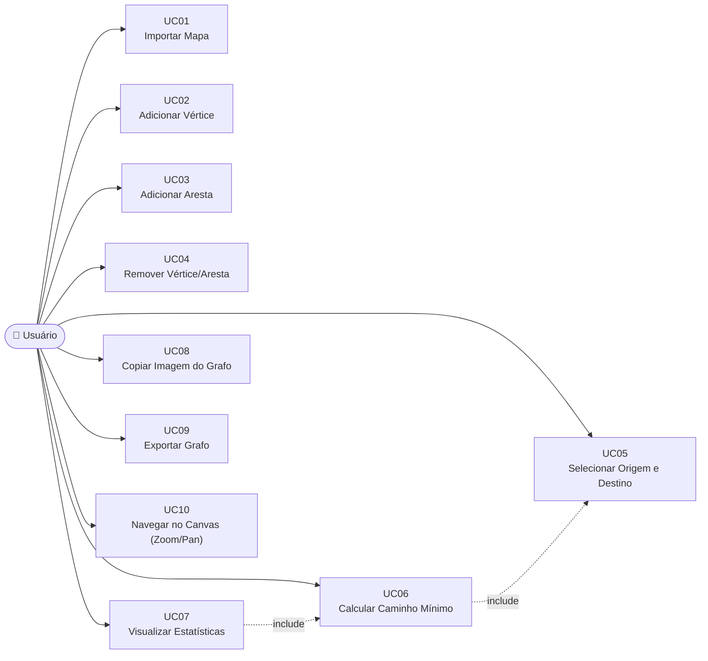

# Documento de Casos de Uso

**Projeto:** Sistema de Navegação Primitivo (Dijkstra)  
**Disciplina:** AED2 — INF/UFG 2026-1  
**Professor:** André L. Moura  
**Versão:** 1.0 | **Data:** 20/05/2026

---

## 1. Diagrama de Casos de Uso

---

## 2. Especificação dos Casos de Uso

---

### UC01 — Importar Mapa

| Campo | Descrição |
|---|---|
| **ID** | UC01 |
| **Nome** | Importar Mapa |
| **Ator** | Usuário |
| **Pré-condições** | O sistema está aberto no navegador. Um arquivo de mapa válido (`.txt`, `.xml`, `.json` ou `.poly`) está disponível no sistema de arquivos local. |
| **Pós-condições** | O grafo contido no arquivo é carregado e exibido no canvas, ajustado para caber na tela. As contagens de vértices e arestas no painel lateral são atualizadas. Qualquer grafo, origem, destino e caminho anteriores são descartados. |

**Fluxo Principal:**
1. O usuário clica no botão "Importar" na barra de ferramentas.
2. O sistema abre o diálogo nativo de seleção de arquivo do sistema operacional, filtrado para `.txt`, `.xml`, `.json`, `.poly`.
3. O usuário navega até o arquivo desejado e confirma a seleção.
4. O sistema lê o conteúdo do arquivo via FileReader API.
5. O sistema detecta o formato pelo sufixo do arquivo e invoca o parser correspondente: `FileIO.parseTXT()`, `FileIO.parseXML()`, `FileIO.parseJSON()` ou `FileIO.parsePOLY()`.
6. O novo objeto `Graph` é construído a partir dos dados do arquivo.
7. O sistema chama `renderer.setGraph()`, `renderer.fitToScreen()` e `renderer.render()`.
8. O painel lateral exibe as contagens atualizadas.
9. A barra de status exibe: "Arquivo importado: [nome] ([V] vértices, [E] arestas)".

**Fluxo Alternativo — A1 (Usuário cancela o diálogo):**
- No passo 3, o usuário fecha o diálogo sem selecionar arquivo. O sistema retorna ao estado anterior sem alterações.

**Fluxo de Exceção — E1 (Formato não reconhecido):**
- No passo 5, o sufixo do arquivo não corresponde a nenhum formato suportado. O sistema exibe na barra de status: "Formato não suportado: use .txt, .xml, .json ou .poly". O grafo anterior é preservado.

**Fluxo de Exceção — E2 (Arquivo malformado):**
- No passo 6, o parser lança uma exceção ao encontrar conteúdo inválido. O sistema exibe: "Erro ao importar: [mensagem do erro]". O grafo anterior é preservado.

**Requisitos Relacionados:** RF01, RNF03, RNF04

---

### UC02 — Adicionar Vértice

| Campo | Descrição |
|---|---|
| **ID** | UC02 |
| **Nome** | Adicionar Vértice |
| **Ator** | Usuário |
| **Pré-condições** | O sistema está em modo "+Vértice" (botão ativo na toolbar ou tecla V pressionada). |
| **Pós-condições** | Um novo vértice é adicionado ao grafo na posição clicada, com o rótulo especificado (ou ID automático). O painel lateral incrementa o contador de vértices. O canvas é redesenhado. |

**Fluxo Principal:**
1. O usuário clica no botão "+Vértice" na toolbar (ou pressiona V).
2. O sistema ativa o modo `ADD_VERTEX`; o cursor muda para crosshair.
3. O usuário clica em uma área vazia do canvas (não sobre um vértice existente).
4. O sistema registra as coordenadas do clique convertidas para o espaço de mundo (`canvasToWorld`).
5. O sistema exibe o modal "Novo Vértice" com campo de rótulo opcional.
6. O usuário insere um rótulo (ou deixa em branco) e confirma clicando em "Adicionar" (ou Enter).
7. O sistema chama `graph.addVertex(wx, wy, label)`, que atribui o próximo ID disponível.
8. O canvas é redesenhado com o novo vértice visível.
9. A barra de status exibe "Vértice adicionado". O texto de dica some se era o primeiro vértice.

**Fluxo Alternativo — A1 (Rótulo em branco):**
- No passo 6, o usuário confirma sem digitar rótulo. O sistema usa o ID numérico do vértice como rótulo padrão.

**Fluxo Alternativo — A2 (Cancelar modal):**
- No passo 6, o usuário clica em "Cancelar" ou pressiona Escape. O vértice não é criado; o sistema retorna ao modo "+Vértice".

**Fluxo de Exceção — E1 (Clique sobre vértice existente):**
- No passo 3, o clique cai sobre a área de colisão de um vértice existente. O sistema ignora o clique e não abre o modal.

**Requisitos Relacionados:** RF05, RNF06

---

### UC03 — Adicionar Aresta

| Campo | Descrição |
|---|---|
| **ID** | UC03 |
| **Nome** | Adicionar Aresta |
| **Ator** | Usuário |
| **Pré-condições** | O grafo possui ao menos dois vértices. O sistema está em modo "+Aresta". |
| **Pós-condições** | Uma nova aresta é criada entre os dois vértices selecionados, com o peso e direcionamento especificados. O painel lateral incrementa o contador de arestas. |

**Fluxo Principal:**
1. O usuário clica no botão "+Aresta" (ou pressiona E).
2. O sistema ativa o modo `ADD_EDGE`; o cursor muda para crosshair.
3. O usuário clica sobre o vértice de origem. O sistema destaca o vértice (borda âmbar) e exibe "Clique no vértice destino" na barra de status.
4. À medida que o usuário move o mouse, o sistema exibe uma linha tracejada de borracha do vértice origem até o cursor.
5. O usuário clica sobre o vértice de destino (diferente do de origem).
6. O sistema exibe o modal "Nova Aresta" com campos de peso (padrão 1) e tipo (não-direcionada selecionada por padrão).
7. O usuário define o peso e o tipo de aresta e confirma clicando em "Criar Aresta" (ou Enter).
8. O sistema chama `graph.addEdge(fromId, toId, weight, directed)`.
9. O canvas é redesenhado com a nova aresta. A barra de status exibe "Aresta criada".

**Fluxo Alternativo — A1 (Clicar no mesmo vértice):**
- No passo 5, o usuário clica no mesmo vértice já selecionado como origem. O sistema desfaz a seleção de origem e retorna ao estado inicial do modo "+Aresta".

**Fluxo Alternativo — A2 (Cancelar modal):**
- No passo 7, o usuário cancela. A aresta não é criada; o modo "+Aresta" permanece ativo e a seleção de origem é limpa.

**Fluxo Alternativo — A3 (Tecla Escape):**
- Em qualquer ponto após o passo 3, o usuário pressiona Escape. A seleção de origem é cancelada e a linha de borracha desaparece.

**Requisitos Relacionados:** RF05, RF06, RNF02

---

### UC04 — Remover Vértice ou Aresta

| Campo | Descrição |
|---|---|
| **ID** | UC04 |
| **Nome** | Remover Vértice ou Aresta |
| **Ator** | Usuário |
| **Pré-condições** | O grafo possui ao menos um vértice ou aresta. O sistema está em modo "Deletar". |
| **Pós-condições** | O vértice ou aresta clicado é removido do grafo. Se um vértice foi removido, todas as arestas adjacentes também são removidas. Se o vértice removido era origem ou destino, essas seleções são limpas. O painel é atualizado. |

**Fluxo Principal:**
1. O usuário clica no botão "Deletar" (ou pressiona Delete/Backspace).
2. O sistema ativa o modo `DELETE`; o cursor muda para `not-allowed`.
3. O usuário clica sobre um vértice no canvas.
4. O sistema chama `graph.removeVertex(id)`, que internamente remove também todas as arestas incidentes.
5. Se o vértice era a origem, `sourceId` é zerado; se era o destino, `targetId` é zerado.
6. O caminho calculado (se existente) é limpo.
7. O canvas é redesenhado e o painel lateral é atualizado.
8. A barra de status exibe "Vértice removido".

**Fluxo Alternativo — A1 (Remover aresta):**
- No passo 3, o usuário clica próximo a uma aresta (e não sobre um vértice). O sistema detecta a aresta mais próxima via `renderer.getEdgeAt()` e chama `graph.removeEdge(id)`. A barra de status exibe "Aresta removida".

**Fluxo de Exceção — E1 (Clique em área vazia):**
- O sistema não encontra vértice nem aresta no ponto clicado (dentro do raio de colisão). Nenhuma ação é executada.

**Requisitos Relacionados:** RF05

---

### UC05 — Selecionar Origem e Destino

| Campo | Descrição |
|---|---|
| **ID** | UC05 |
| **Nome** | Selecionar Vértice de Origem e Destino |
| **Ator** | Usuário |
| **Pré-condições** | O grafo possui ao menos um vértice. |
| **Pós-condições** | Um vértice é marcado como origem (verde) e/ou um vértice diferente é marcado como destino (vermelho). O painel lateral exibe os rótulos selecionados. Qualquer caminho calculado anteriormente é limpo. |

**Fluxo Principal — Selecionar Origem:**
1. O usuário clica no botão "Origem" (ou pressiona S).
2. O sistema ativa o modo `SELECT_SOURCE`; cursor muda para pointer.
3. O usuário clica sobre um vértice.
4. Se o vértice não era a origem: ele torna-se a nova origem; `renderer.sourceId` é atualizado; o vértice é redesenhado em verde. Se o vértice clicado era igual ao destino atual, o destino é automaticamente desmarcado.
5. Se o vértice já era a origem (toggle): a origem é desmarcada.
6. O painel lateral e a barra de status são atualizados.

**Fluxo Principal — Selecionar Destino:**
1. O usuário clica no botão "Destino" (ou pressiona T).
2. Processo análogo ao de origem, com a cor vermelha e `SELECT_TARGET`.

**Fluxo de Exceção — E1 (Clicar em área vazia):**
- Nenhum vértice é detectado no ponto do clique. O estado de seleção não é alterado.

**Requisitos Relacionados:** RF03, RNF01

---

### UC06 — Calcular Caminho Mínimo (Dijkstra)

| Campo | Descrição |
|---|---|
| **ID** | UC06 |
| **Nome** | Calcular Caminho Mínimo |
| **Ator** | Usuário |
| **Pré-condições** | Um vértice de origem está selecionado (verde). Um vértice de destino está selecionado (vermelho). |
| **Pós-condições** | O caminho mínimo é calculado e destacado no canvas (âmbar). As estatísticas do painel (tempo, nós explorados, custo) são atualizadas. |

**Fluxo Principal:**
1. O usuário clica no botão "Calcular" (ou pressiona Enter).
2. O sistema verifica que `sourceId` e `targetId` são válidos.
3. O sistema chama `runDijkstra(graph, sourceId)`.
4. O algoritmo executa: inicializa distâncias como Infinity, insere origem na MinHeap com prioridade 0, itera extraindo o vértice de menor distância, relaxa as arestas vizinhas.
5. Ao término, é criado um objeto `DijkstraResult` com `dist`, `prev`, `explored` e `timeMs`.
6. O sistema chama `dijkstraResult.getPath(targetId)` para reconstruir o caminho.
7. O sistema chama `renderer.setPath(path, dijkstraResult)`: vértices no caminho entram em `pathVertices`, arestas correspondentes em `pathEdges`, todos os vértices alcançados entram em `exploredVertices`.
8. O canvas é redesenhado com o destaque.
9. O sistema chama `updateStats()` para atualizar o painel.
10. A barra de status exibe: "Caminho encontrado! Custo total: [valor]".

**Fluxo Alternativo — A1 (Sem caminho):**
- No passo 6, `getPath(targetId)` retorna `null` (destino inacessível a partir da origem). O sistema exibe "Sem caminho entre origem e destino". O canvas é redesenhado sem destaque de caminho (mas com nós explorados).

**Fluxo de Exceção — E1 (Origem não selecionada):**
- No passo 2, `sourceId` é null. O sistema exibe "Selecione um vértice de origem primeiro (modo Origem)". Nada é calculado.

**Fluxo de Exceção — E2 (Destino não selecionado):**
- No passo 2, `targetId` é null. O sistema exibe "Selecione um vértice de destino primeiro (modo Destino)". Nada é calculado.

**Requisitos Relacionados:** RF04, RF07, RNF04

---

### UC07 — Visualizar Estatísticas

| Campo | Descrição |
|---|---|
| **ID** | UC07 |
| **Nome** | Visualizar Estatísticas do Algoritmo |
| **Ator** | Usuário |
| **Pré-condições** | O Dijkstra foi executado ao menos uma vez após a seleção de origem e destino. |
| **Pós-condições** | O painel lateral exibe as estatísticas atualizadas da última execução. |

**Fluxo Principal:**
1. Após a execução do Dijkstra (UC06), o sistema automaticamente chama `updateStats()`.
2. O painel lateral exibe na seção "Algoritmo": tempo de execução (ex.: "12.345 ms"), nós explorados (ex.: "487"), custo total (ex.: "2340.5").
3. O painel exibe na seção "Rota": distância total e a sequência de rótulos dos vértices do caminho separados por "→".
4. O usuário lê as informações no painel lateral a qualquer momento.

**Fluxo Alternativo — A1 (Sem caminho):**
- Distância e custo exibem "∞". Caminho exibe "—".

**Requisitos Relacionados:** RF07

---

### UC08 — Copiar Imagem do Grafo

| Campo | Descrição |
|---|---|
| **ID** | UC08 |
| **Nome** | Copiar Imagem do Canvas para Clipboard |
| **Ator** | Usuário |
| **Pré-condições** | O navegador suporta a Clipboard API (`navigator.clipboard.write`). O canvas contém ao menos algum conteúdo. |
| **Pós-condições** | A imagem PNG do canvas é copiada para a área de transferência do sistema operacional. |

**Fluxo Principal:**
1. O usuário clica no botão "Copiar Imagem" (ou pressiona Ctrl+C quando o foco não está em campo de texto).
2. O sistema chama `renderer.copyToClipboard()`.
3. O canvas é convertido para Blob PNG via `canvas.toBlob()`.
4. O sistema invoca `navigator.clipboard.write([new ClipboardItem({'image/png': blob})])`.
5. A barra de status exibe "Imagem copiada para a área de transferência!".
6. O usuário pode colar a imagem em qualquer aplicativo (editor de imagem, documento, chat).

**Fluxo de Exceção — E1 (Permissão negada):**
- No passo 4, o navegador recusa a operação (ex.: página carregada via protocolo `file://` em alguns navegadores). A barra de status exibe "Não foi possível copiar a imagem: [mensagem do erro]".

**Requisitos Relacionados:** RF08, RNF07

---

### UC09 — Exportar Grafo

| Campo | Descrição |
|---|---|
| **ID** | UC09 |
| **Nome** | Exportar Grafo para Arquivo |
| **Ator** | Usuário |
| **Pré-condições** | O grafo possui ao menos um vértice. |
| **Pós-condições** | Um arquivo `grafo.txt` é baixado para o sistema de arquivos local contendo a representação textual completa do grafo corrente. |

**Fluxo Principal:**
1. O usuário clica no botão "Exportar" na barra de ferramentas.
2. O sistema chama `FileIO.exportTXT(graph)`, gerando o conteúdo textual com cabeçalho de comentário, linhas V para vértices e linhas E para arestas.
3. O sistema chama `FileIO.downloadFile(content, 'grafo.txt', 'text/plain')`.
4. O browser cria um link temporário para download e aciona o clique programaticamente.
5. O navegador inicia o download do arquivo `grafo.txt`.
6. A barra de status exibe "Grafo exportado como grafo.txt".

**Fluxo de Exceção — E1 (Grafo vazio):**
- O arquivo é gerado apenas com o cabeçalho de comentário e linhas em branco. O download ocorre normalmente.

**Requisitos Relacionados:** RF01 (reimportação do arquivo exportado), RF05

---

### UC10 — Navegar no Canvas (Zoom e Pan)

| Campo | Descrição |
|---|---|
| **ID** | UC10 |
| **Nome** | Navegar no Canvas (Zoom/Pan) |
| **Ator** | Usuário |
| **Pré-condições** | O canvas está visível com ao menos algum conteúdo renderizado. |
| **Pós-condições** | A visão do canvas é ajustada conforme a interação do usuário (zoom ampliado/reduzido, ou câmera deslocada). |

**Fluxo Principal — Pan (Arrastar):**
1. O sistema está no modo "Pan" (padrão) ou o usuário pressiona P.
2. O usuário pressiona e segura o botão esquerdo do mouse sobre o canvas.
3. O cursor muda para `grabbing`.
4. Enquanto o usuário arrasta, o sistema calcula o deslocamento em pixels e chama `renderer.pan(dx, dy)`.
5. O canvas é redesenhado continuamente durante o arrasto.
6. Ao soltar o mouse, o cursor retorna para `grab`.

**Fluxo Principal — Zoom (Roda do Mouse):**
1. O usuário gira a roda do mouse sobre o canvas.
2. O sistema calcula o fator de zoom (`ZOOM_FACTOR = 1.15` para aproximar, `1/1.15` para afastar).
3. O sistema chama `renderer.zoom(factor, cx, cy)`, mantendo o ponto sob o cursor fixo na tela.
4. O canvas é redesenhado com a nova escala (respeitando `MIN_ZOOM = 0.05` e `MAX_ZOOM = 15`).

**Fluxo Alternativo — Botões de Zoom:**
- O usuário clica nos botões "+", "-", "Fit" ou "1:1" no painel lateral. O sistema aplica zoom ou reposiciona a câmera conforme o botão. "Fit" chama `fitToScreen()` para ajustar todos os vértices na tela. "1:1" redefine `scale = 1` e `camX = camY = 0`.

**Requisitos Relacionados:** RNF03, RNF06
