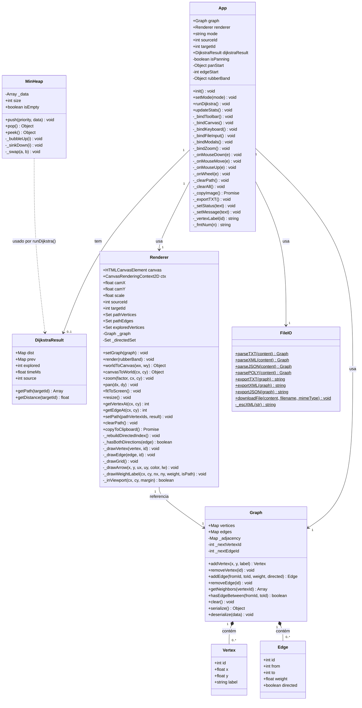
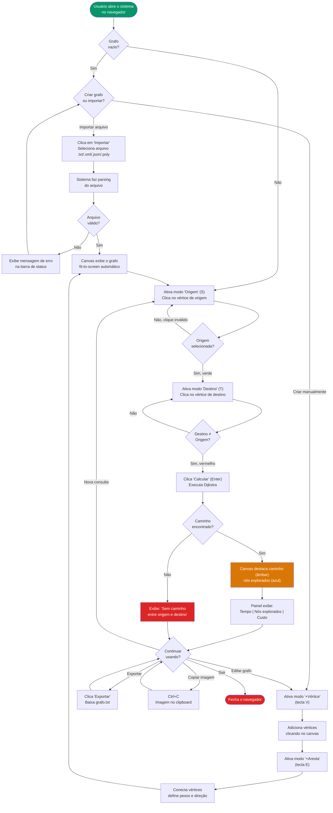
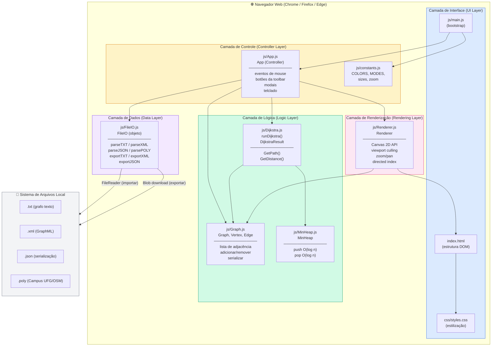

# Diagramas UML do Sistema

**Projeto:** Sistema de Navegação Primitivo (Dijkstra)  
**Disciplina:** AED2 — INF/UFG 2026-1  
**Versão:** 1.0 | **Data:** 20/05/2026

> Todos os diagramas utilizam sintaxe Mermaid e renderizam em GitHub, GitLab e VSCode (extensão Mermaid Preview).

---

## 4.1 Diagrama de Classes



---

## 4.2 Diagrama de Sequência — Calcular Caminho Mínimo

```mermaid
sequenceDiagram
    actor U as Usuário
    participant A as App
    participant G as Graph
    participant D as runDijkstra()
    participant H as MinHeap
    participant DR as DijkstraResult
    participant R as Renderer

    U->>A: clica "Calcular" (ou Enter)
    A->>A: verifica sourceId != null
    A->>A: verifica targetId != null
    A->>D: runDijkstra(graph, sourceId)
    D->>G: graph.vertices (iteração)
    D->>D: inicializa dist[v] = Infinity para todo v
    D->>D: dist[sourceId] = 0
    D->>H: new MinHeap()
    D->>H: push(0, sourceId)

    loop enquanto !heap.isEmpty
        D->>H: pop() → {priority: d, data: u}
        D->>D: se visited.has(u): continue
        D->>D: visited.add(u); explored++
        D->>G: getNeighbors(u) → [{to, weight, edgeId}]
        loop para cada vizinho v
            D->>D: alt = dist[u] + weight
            D->>D: se alt < dist[v]
            D->>D: dist[v] = alt; prev[v] = u
            D->>H: push(alt, v)
        end
    end

    D->>DR: new DijkstraResult(dist, prev, explored, timeMs, sourceId)
    D-->>A: retorna DijkstraResult
    A->>DR: getPath(targetId)
    DR->>DR: reconstrói caminho via prev[]
    DR-->>A: retorna Array de vertexIds (ou null)

    alt caminho encontrado
        A->>R: setPath(path, dijkstraResult)
        R->>R: popula pathVertices, pathEdges, exploredVertices
        A->>R: render(null)
        R->>R: rebuildDirectedIndex()
        R->>R: desenha edges (com culling)
        R->>R: desenha vertices (com culling)
        A->>A: updateStats()
        A->>A: _setMessage("Caminho encontrado! Custo: X")
    else sem caminho
        A->>R: clearPath()
        A->>R: render(null)
        A->>A: _setMessage("Sem caminho entre origem e destino")
    end

    A-->>U: canvas atualizado + painel com estatísticas
```

---

## 4.3 Diagrama de Sequência — Importar Mapa

```mermaid
sequenceDiagram
    actor U as Usuário
    participant A as App
    participant FI as FileIO
    participant FR as FileReader
    participant G as Graph
    participant R as Renderer

    U->>A: clica "Importar"
    A->>A: document.getElementById('file-input').click()
    A-->>U: diálogo nativo de arquivo (browser)
    U->>A: seleciona arquivo (ex: Campus2UFG.poly)

    A->>FR: new FileReader(); readAsText(file)
    FR-->>A: onload: ev.target.result = conteúdo

    A->>A: detecta extensão do arquivo

    alt extensão == "poly"
        A->>FI: FileIO.parsePOLY(content)
        FI->>FI: lê cabeçalho (nVerts)
        loop para cada vértice
            FI->>G: graph.addVertex(x, y, label)
        end
        FI->>FI: lê cabeçalho de arestas (nEdges)
        loop para cada aresta
            FI->>FI: calcula peso = distância euclidiana
            FI->>G: graph.addEdge(from, to, weight, directed)
        end
    else extensão == "txt"
        A->>FI: FileIO.parseTXT(content)
    else extensão == "xml"
        A->>FI: FileIO.parseXML(content)
    else extensão == "json"
        A->>FI: FileIO.parseJSON(content)
    end

    FI-->>A: retorna Graph populado

    A->>A: this.graph = newGraph
    A->>A: sourceId = null; targetId = null; dijkstraResult = null
    A->>R: renderer.setGraph(newGraph)
    A->>R: renderer.clearPath()
    A->>R: renderer.resize()
    A->>R: renderer.fitToScreen()
    A->>A: updateStats()
    A->>R: renderer.render(null)
    A->>A: _setMessage("Arquivo importado: nome (V vértices, E arestas)")
    A-->>U: canvas exibe o mapa importado
```

---

## 4.4 Diagrama de Atividades — Algoritmo de Dijkstra

```mermaid
flowchart TD
    Start([Início: runDijkstra\ngraph, sourceId]) --> Init

    Init["Inicializar:
    dist[v] = Infinity para todo v ∈ V
    prev[v] = null para todo v ∈ V
    visited = {} (conjunto vazio)
    explored = 0"]

    Init --> SetSource["dist[sourceId] = 0"]
    SetSource --> PushHeap["heap.push(0, sourceId)"]
    PushHeap --> CheckHeap{heap.isEmpty?}

    CheckHeap -->|Sim| BuildResult["Criar DijkstraResult
    (dist, prev, explored, timeMs, source)"]
    BuildResult --> Return([Retorna DijkstraResult])

    CheckHeap -->|Não| Pop["u, d = heap.pop()
    (extrai vértice de menor distância)"]
    Pop --> Visited{visited\ncontém u?}
    Visited -->|Sim| CheckHeap
    Visited -->|Não| MarkVisited["visited.add(u)
    explored++"]

    MarkVisited --> GetNeighbors["neighbors = graph.getNeighbors(u)"]
    GetNeighbors --> ForEach["Para cada {to: v, weight: w} em neighbors"]

    ForEach --> Relax["alt = dist[u] + w"]
    Relax --> BetterPath{alt < dist[v]?}

    BetterPath -->|Não| NextNeighbor{Mais\nvizinhos?}
    BetterPath -->|Sim| Update["dist[v] = alt
    prev[v] = u"]
    Update --> PushV["heap.push(alt, v)"]
    PushV --> NextNeighbor

    NextNeighbor -->|Sim| ForEach
    NextNeighbor -->|Não| CheckHeap

    style Start fill:#059669,color:#fff
    style Return fill:#059669,color:#fff
    style Init fill:#3B82F6,color:#fff
    style MarkVisited fill:#F59E0B,color:#fff
    style Update fill:#D97706,color:#fff
```

---

## 4.5 Diagrama de Atividades — Fluxo de Uso Principal



---

## 4.6 Diagrama de Componentes


